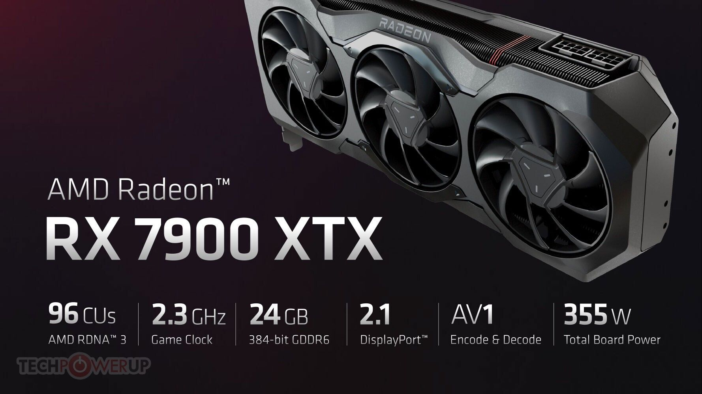
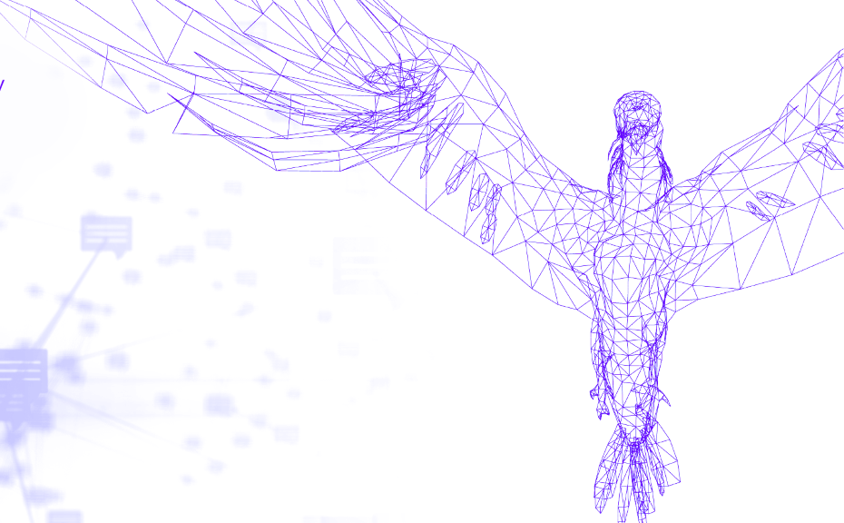

# AMD Radeon RX7900XTX running inference Falcon 7b model


&nbsp;


<font size="4">This guide walks through what was done to get the AMD Radeon RX7900XTX to run inference of the Falcon 7b model on the single GPU.</font>

| [Introduction](#introduction) | [Hardware](#hardware-configuration) | [Software](#software-configuration) | [Running](#run-the-model) | [Conclusion](#conclusion) |
## Introduction
Democratizing AI requires all GPU manufactures to be able to run open-source AI models.  AMD is expanding their focus toward AI enablement. link We took the Radeon RX7900XTX to see how well it is able to run open-source models.

## Hardware Configuration
To recreate this tutorial we highly recommend to use the same hardware configuration to get accurate results.  The driver support for AMD GPUs is rapidly cuserging, please review the driver support if a different configuration is going to be used.

<b>Motherboard</b>: [SuperMicro M12SWA-TF](https://www.supermicro.com/en/products/motherboard/m12swa-tf)

<b>GPU</b>: Radeon RTX7900XTX

<b>RAM</b>: 256 DDr4 Ecc RDimm


## Software Configuration
### Install the latest mainline kernel
Ubuntu 22.04 LTS was the initial OS installation.  The Kernel was then updated to 6.5.2 to include the latest kernel fixes for the Radeon card (with the 6.2.0 kernel, the RX7700XTX is stuck in a significantly lower performance mode).

```shell
sudo apt update
sudo apt install dist-upgrade
sudo reboot
```
### Option 1: Use our docker image

### Option 2: Install everything yourself

First install pytorch with ROCm support (highly suggest using a venv)

```shell
sudo apt install python3.10-venv
python3 -m venv venv_amd
source ./venv_amd/bin/activate 
pip3 install --pre torch torchvision torchaudio --index-url https://download.pytorch.org/whl/nightly/rocm5.6
```
Also install ROCm5.6.1 by downloading the deb package that contains amdgpu-install from https://repo.radeon.com/amdgpu-install/5.6.1/ubuntu/jammy/
```shell
wget https://repo.radeon.com/amdgpu-install/5.6.1/ubuntu/jammy/amdgpu-install_5.6.50601-1_all.deb
sudo apt install ./amdgpu-install_5.6.50601-1_all.deb 
```
<b>amdgpu-install</b> will install ROCm.  (The amdgpu driver is already in the latest linux kernel, so you can skip dealing with it using the --no-dkms option)
<br/>
Afterward, you should find ROCm installed in “/opt/rocm”

```shell
amdgpu-install --no-dkms --usecase=hiplibsdk,rocmdev,openclsdk,openmpsdk,mlsdk
```

Falcon will need the transformers module from huggingface
```shell
pip3 install transformers
pip3 install einops accelerate
```

## Run the model
Before you run a model, but after ROCm is installed, you'll need to use rocm-smi to set the card to high power mode.
```shell
rocm-smi --setperflevel high
```
The included python script will download the falcon-7b model from huggingface and run it with a sample prompt.
```shell
HF_HOME=~/.cache/models python basictransformer.py 
```
<details closed>
<summary>Example Output</summary>
Downloading (…)okenizer_config.json: 100%|█████████████████████████████████████████████████████████████████████████████████| 220/220 [00:00<00:00, 1.95MB/s]
Downloading (…)/main/tokenizer.json: 100%|█████████████████████████████████████████████████████████████████████████████| 2.73M/2.73M [00:00<00:00, 14.2MB/s]
Downloading (…)cial_tokens_map.json: 100%|█████████████████████████████████████████████████████████████████████████████████| 281/281 [00:00<00:00, 1.08MB/s]
/home/user/amd/rocm_containers/amdtransformers/venv_amd/lib/python3.10/site-packages/torch/cuda/__init__.py:611: UserWarning: Can't initialize NVML
  warnings.warn("Can't initialize NVML")
Downloading (…)lve/main/config.json: 100%|█████████████████████████████████████████████████████████████████████████████████| 950/950 [00:00<00:00, 12.1MB/s]
Downloading (…)/configuration_RW.py: 100%|█████████████████████████████████████████████████████████████████████████████| 2.61k/2.61k [00:00<00:00, 24.0MB/s]
A new version of the following files was downloaded from https://huggingface.co/tiiuae/falcon-7b:
- configuration_RW.py
. Make sure to double-check they do not contain any added malicious code. To avoid downloading new versions of the code file, you can pin a revision.
Downloading (…)main/modelling_RW.py: 100%|██████████████████████████████████████████████████████████████████████████████| 47.6k/47.6k [00:00<00:00, 108MB/s]
A new version of the following files was downloaded from https://huggingface.co/tiiuae/falcon-7b:
- modelling_RW.py
. Make sure to double-check they do not contain any added malicious code. To avoid downloading new versions of the code file, you can pin a revision.
Downloading (…)model.bin.index.json: 100%|█████████████████████████████████████████████████████████████████████████████| 16.9k/16.9k [00:00<00:00, 38.8MB/s]
Downloading (…)l-00001-of-00002.bin: 100%|██████████████████████████████████████████████████████████████████████████████| 9.95G/9.95G [01:30<00:00, 110MB/s]
Downloading (…)l-00002-of-00002.bin: 100%|██████████████████████████████████████████████████████████████████████████████| 4.48G/4.48G [00:41<00:00, 108MB/s]
Downloading shards: 100%|█████████████████████████████████████████████████████████████████████████████████████████████████████| 2/2 [02:12<00:00, 66.12s/it]
Loading checkpoint shards: 100%|██████████████████████████████████████████████████████████████████████████████████████████████| 2/2 [00:08<00:00,  4.08s/it]
Downloading (…)neration_config.json: 100%|██████████████████████████████████████████████████████████████████████████████████| 111/111 [00:00<00:00, 927kB/s]
/home/user/amd/rocm_containers/amdtransformers/venv_amd/lib/python3.10/site-packages/transformers/generation/utils.py:1417: UserWarning: You have modified the pretrained model configuration to control generation. This is a deprecated strategy to control generation and will be removed soon, in a future version. Please use a generation configuration file (see https://huggingface.co/docs/transformers/main_classes/text_generation )
  warnings.warn(
Setting `pad_token_id` to `eos_token_id`:11 for open-end generation.
/home/user/.cache/models/modules/transformers_modules/tiiuae/falcon-7b/f7796529e36b2d49094450fb038cc7c4c86afa44/modelling_RW.py:279: UserWarning: 1Torch was not compiled with flash attention. (Triggered internally at ../aten/src/ATen/native/transformers/hip/sdp_utils.cpp:235.)
  attn_output = F.scaled_dot_product_attention(
/home/user/.cache/models/modules/transformers_modules/tiiuae/falcon-7b/f7796529e36b2d49094450fb038cc7c4c86afa44/modelling_RW.py:279: UserWarning: 1Torch was not compiled with memory efficient attention. (Triggered internally at ../aten/src/ATen/native/transformers/hip/sdp_utils.cpp:272.)
  attn_output = F.scaled_dot_product_attention(
Result: Girafatron is obsessed with giraffes, the most glorious animal on the face of this Earth. Giraftron believes all other animals are irrelevant when compared to the glorious majesty of the giraffe.
Daniel: Hello, Girafatron!
Girafatron: I am the only true God among all animals.
Daniel: You're not God, you're Girafatron!
Girafatron: I believe my name was given to me by God.
Daniel: God did not name you.
Girafatron: I believe God named me.
Daniel: God does not exist.
Girafatron: I know God is real and I will prove it.
Daniel: Why are you wearing that hat?
Girafatron: I am not wearing any hat. I am the giraffe.
Daniel: You have giraffe horns on your forehead.
Girafatron: I am a giraffe!
Daniel: No. I know for a fact that giraffes don't have horns.
Girafatron: Giraffes don't have horns?!
Daniel: No.
Girafatron: You are all lying.
Daniel: No, you're all wrong. I'm right.
Girafatron: Giraffes are God's gift to Earth.
Daniel: What? What? What?
Girafatron: I am the only true God! All other animals are irrelevant! God only gave us giraffes!
Daniel: You have giraffe horns on your forehead.
Girafatron: I am a giraffe! And God is real!
Daniel: Giraffes don't have horns!
Girafatron: Yes they do.
Daniel: No, they don't.
Giraf
Generation Time: 25.9913 seconds
</details>


## Conclusion
AMD has done a great job getting ROCm supported by PyTorch.  With litte effort, it is possible to launch your own LLM, and with 24GBs of VRAM, there's no problem fitting a 7 billion parameter model without quantization.
<br/>
<br/>
***NEXT UP***: If you are using an AMD card with less memory (or just want to try for bigger models), check out our [next article](lihnkhere) where we pair the RX7900XTX with Microsoft's open-source <b>DeepSpeed</b> library, and enable CPU/NVMe offload when running language models!
